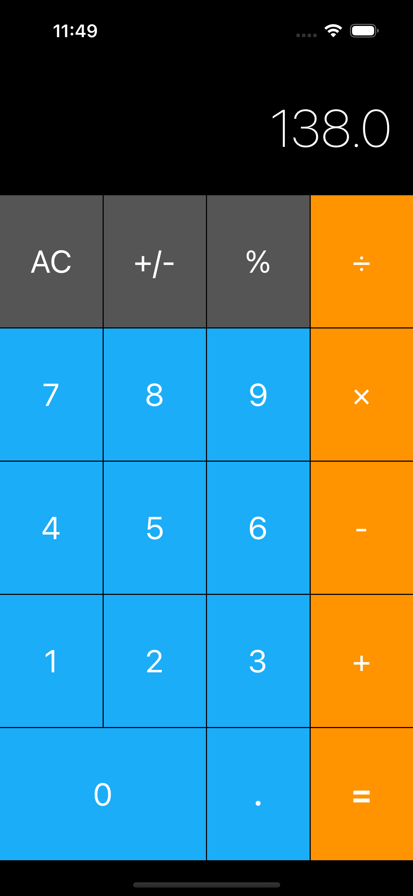

# Calculator App

A simple and elegant calculator app built with Swift, designed for iOS devices. This app provides basic arithmetic operations with a clean and intuitive user interface.

## Features

- Basic arithmetic operations: Addition, Subtraction, Multiplication, Division
- Clear and responsive user interface
- Real-time calculations and error handling
- Support for decimal numbers

## Screenshots



## Requirements

- iOS 13.0+
- Xcode 12.0+
- Swift 5.0+

## Installation

1. Clone the repository to your local machine:

    ```bash
    git clone https://github.com/ilequeque/layout-calculator
    ```

2. Open the project in Xcode:

    ```bash
    cd layout-calculator
    open Calculator Layout iOS13.xcodeproj
    ```

3. Build and run the project on the iOS Simulator or a physical device.

## Usage

1. Launch the app on your iOS device.
2. Use the number pad to enter numbers.
3. Tap on the arithmetic operation buttons (+, -, *, /) to perform calculations.
4. Use the "=" button to get the result.
5. Use the "AC" button to clear the current input.

## Project Structure

- `CalculatorApp/`: Main source folder containing the Swift files.
- `CalculatorApp/Controllers/`: Contains view controllers.
- `CalculatorApp/Views/`: Contains custom UI views.
- `CalculatorApp/Models/`: Contains model classes.
- `CalculatorApp/Assets.xcassets/`: Contains image assets and other resources.
- `CalculatorApp/Info.plist`: Contains app configuration settings.

## Contributing

1. Fork the repository.
2. Create a new branch:

    ```bash
    git checkout -b feature/your-feature-name
    ```

3. Make your changes and commit them:

    ```bash
    git commit -m "Add your commit message"
    ```

4. Push to the branch:

    ```bash
    git push origin feature/your-feature-name
    ```

5. Open a pull request.

## Acknowledgements

- Inspired by various calculator apps on the App Store.
- Thanks to the iOS development community for their tutorials and support.
